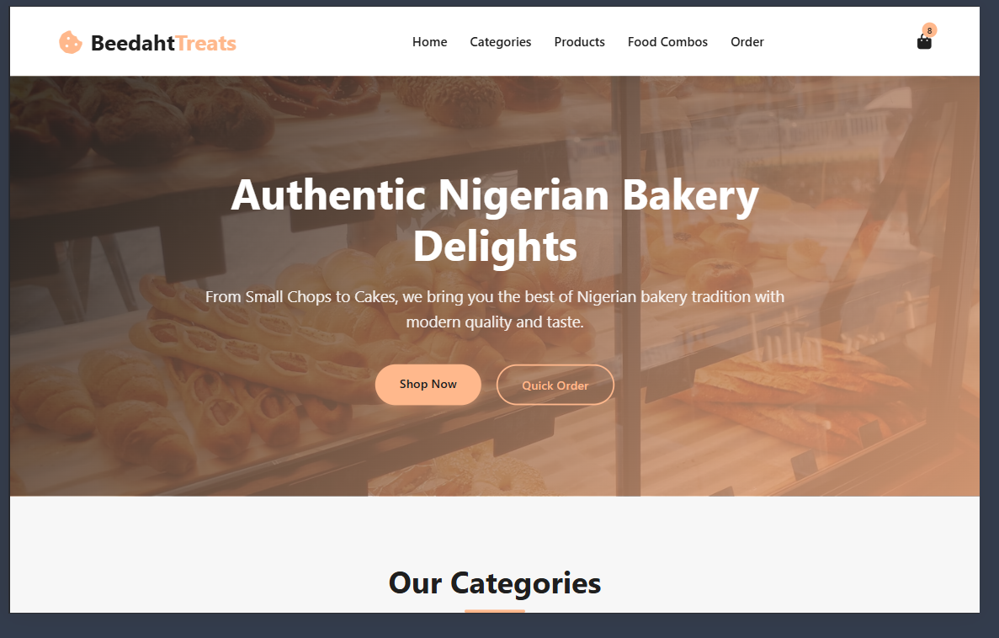

# 🍰 Cake Shop - Frontend E-Commerce Website

A responsive frontend e-commerce website for a cake shop that allows users to browse cakes, foods, and drinks, add items to cart, and simulate purchases.

## 🚀 Features

- 🧁 Browse cakes, foods, and drinks
- 🛒 Add items to cart
- ➕ Increase / decrease item quantity
- 💰 Dynamic total price calculation
- 📱 Responsive design
- 🎨 Clean and modern UI

## 🛠️ Built With

- HTML
- CSS
- JavaScript

## 📸 Screenshots

## 📌 Future Improvements

- User authentication
- Payment integration
- Backend integration
- Order history

## 👤 Author

geeooh